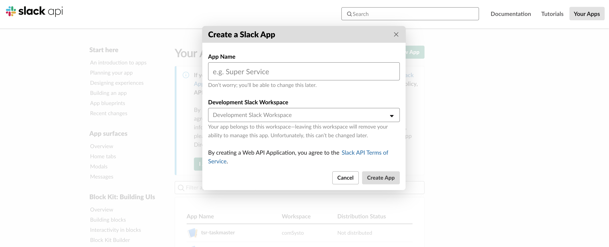
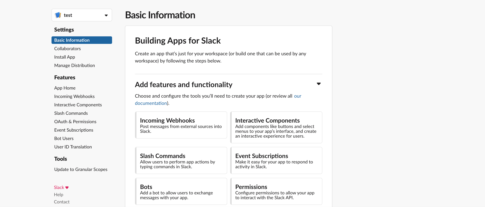
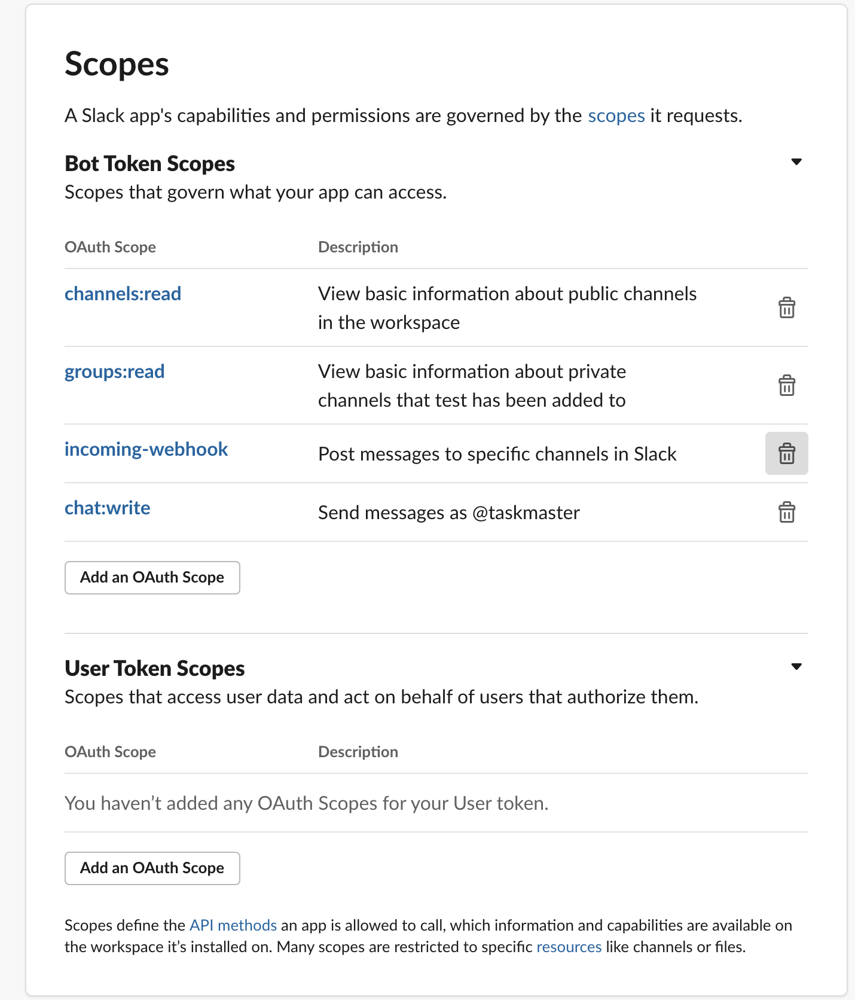
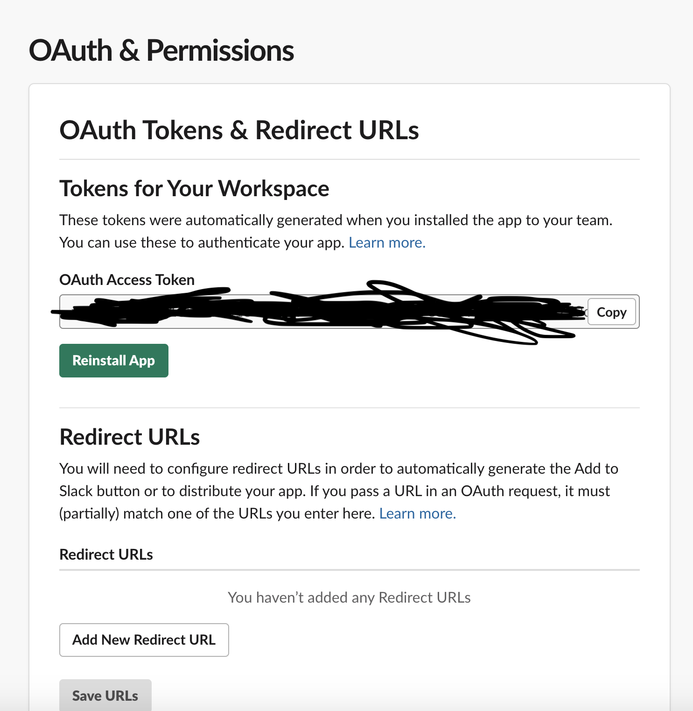

# taskmaster_slack

Taskmaster Slack lets you configure reminders for your team in a slack channel to be send daily (except weekends). Reminders will be rotated among your team so that every member will get their turn ;)

## How to add a custom app to your workspace

In order for taskmaster_slack to work you need to register a custom app to your workspace. First go to slack app directory [here](https://api.slack.com/apps) and click `Create New App` for registering a new app to your workspace.

 


Here you can give any name you like and more importantly the workspace of your organization.

After creating the app, permissions needs to be defined so that taskmaster server compant can receive a token with permission to get channel information and send message to channel.

Under Basic Information go to `Add features and functionality` and choose `Permisions`



You will redirected to `OAuth & Permissions` page where you need to define scope of your app. The scopes should look like the following:



After adding the required permssion you can install the app by clicking `Install App to Workspace` on the same page.

With successful installation you can use OAuth access token to access slack api and do actions permitted via the OAuth Permission defined befoore





## How to configure Taskmaster Server

The current implementation is an server app written for Node.js. You can either run it from local environment or install it on a cloud provider. Taskmaster uses environment variables to make requests to slack api and to configure node scheduler. When running locally you can create an .env file in the root directory and fill the required variables.

Example:

```
SLACK_ACCESS_TOKEN=slick_token
SLACK_SIGNING_SECRET=secret
SLACK_CHANNEL=test_channel
SLACK_CHANNEL_PRIVATE=false
SCHEDULE_HOUR=7
SCHEDULE_MINUTE=15
```

- This example configuration states, that the node scheduler will run at 07:15 UTC and send all task reminders to public channel
with id `test_channel`. 
- `SLACK_ACCESS_TOKEN` is the OAuth token previously configured while installing our app.
- If the channel is private you need to set `SLACK_CHANNEL_PRIVATE` true.
- Node scheduler works with UTC, so consider timezones while setting your node server

## Setting up database

Taskmaster app uses Postgres database to store reminders. Currently there is no way to insert tasks with an User Interface. But I have plan for implementing slack command to make it more user friendly.

The database schema consists of one table with following schema

Column Name| Type | Description 
-----------|-------|----------
remaining_users|varchar|list of users not assigned to a task yet. Formatted as json array
assignee_count|int|number of people to assign to a task 
task|varchar|description of task to be sent as slack message
users|varchar|list of users, where task assignment will rotate. Formatted as json array 

- If you want to add/remove a user from your team just update users column
- Update asssignee_count to a assign a task to more than one person
- Do not modifty remaining_users as the application itself will update it
- Update task column if you want to change the content of the slack message.
- users column must be in following format `[userId1, userId2,userId3]` Element of the list must be the slack id of the person. You can check the profile of a user to see their slack id.

## Current limitations

- Slack server requires a dedicated Postgres database for persistance. I used Heroku's free plan for postgres, since the database is free for 10000 columns. 
- All tasks have the same scheduled time, so you cannot configure different tasks with different schedule.
- There is no interface for configuring the database.
- Slack server requires a running server, eventhough it only requires computing once per day.
- Schedeuler does not consider public holidays, so you can get spammed on your vacation :(


## Future improvements

- Support for other persistance and cheaper persistance types
- Support for different schedule tasks
- Provide a way to confiure tasks with an interface like slack commands or rest api
- Consider serverless solution supporting on demand computing like Amazon Lambda
- Add capability to import list of public holidays for not spamming your team ;)


